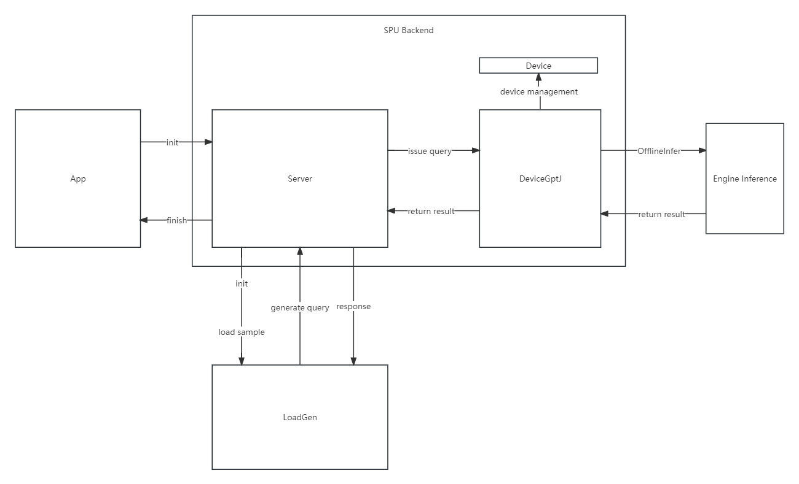

# Moffett GPTJ Project Overview

## Introduction
This project entails the utilization of the MLPerf inference benchmark to rigorously assess the performance of the GPTJ model on Moffett devices. The project seeks to validate the efficiency and accuracy of GPTJ through systematic testing.

## GPTJ Inference Process
The core of our project involves conducting end-to-end inference leveraging the GPT-J model on Moffett S30 devices. The methodology encompasses deploying the MLPerf inference benchmark to meticulously evaluate both performance metrics and result accuracy.

Two pivotal functions contribute to the process: `GPTJDataProcess` and `GPTJResponseCallback`. The former orchestrates the preparation of input data for inference, while the latter handles the post-inference results, facilitating their transmission back to the server. In tandem with these functions, an inference mechanism is established. This mechanism configures the test settings, logging configurations, backend specifications, and server parameters. Furthermore, it creates a server object employing the `DeviceGptJ` class to embody a device dedicated to GPT-J model execution. Additionally, a sample library object is generated to facilitate data input, drawing from files or databases.

## Server Infrastructure
The `Server` class acts as an implementation of the `mlperf::SystemUnderTest` interface, a necessity for adhering to the MLPerf inference benchmark specifications. The server is entrusted with the roles of query processing, batching management, and issuance of requests.

**AddSampleLibrary**: This method augments a sample library to a device, thereby loading the requisite input data for inference. The flexibility to accommodate multiple devices is afforded through the `device_idx` parameter, while the `SampleLoader` object manages data loading from diverse sources.

**Setup**: Configuring the server is facilitated by this method, which accepts settings and parameters. The `settings` parameter encapsulates common attributes shared among all devices, encompassing scenarios, modes, etc. Meanwhile, the `params` parameter, encompassing specifics such as device IDs and engine designations, is encapsulated within the `ServerParams` object. The `result_process` function plays a pivotal role in processing inference outcomes and subsequently channeling them back to the server.

**IssueQuery**: A pivotal function responsible for forwarding queries to the pipelining queue. Each query contains an identifier and index, facilitating the retrieval of input data from the sample library and the construction of inference batches. The identifier is instrumental in distinguishing samples during the result processing stage. This function further streamlines the allocation of queries to distinct devices based on their availability and batch dimensions.

## Device Management

The abstract `Device` class serves as a unifying interface for all devices primed for inference. It offers a framework to streamline the management of resources across multiple devices, thus enhancing overall inference efficiency. Crucial backend settings such as batch size, NUMA configuration, and operational mode are pivotal for optimizing acceleration.

**OfflineInfer**: This virtual method necessitates subclass overrides for performing device-specific inference. The method also necessitates invoking the `result_process` function to manage outcome handling.

**Allocator**: Allocation management for input or output data, inclusive of size and location (on-device or on-host), is facilitated by this function.

**DataPrepare**: This method readies input data for inference, involving conversions and potential padding.

## DeviceGptJ: Specialized Device

Derived from the `Device` class, `DeviceGptJ` specifically caters to GPT-J model execution.

**Settings**: The efficacy of GPTJ execution hinges on configuring backend settings aligned with optimal operational modes.

**result_process**: This function primarily focuses on processing inference outcomes, isolating relevant segments, and orchestrating their return to the server. The `DeviceGptJ` class further overrides several methods from the parent `Device` class.

**OfflineInfer**: This method spearheads batch-based inference, utilizing the `engine_->Infer` mechanism for the actual inference. This method streamlines workflow pipelining and harnesses a sparsity-aware model to expedite inference acceleration.